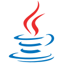

<!-- README Header -->
<!-- <h1 align="center">Hello👋 I'm Chris!</h1> -->

<!-- Programming Languages -->
<h2 align="center">Programming Languages</h2>

    
    
    
    
    
<!--      -->
<!--      -->
<!--      -->
<!--      -->

<!-- Programming Technologies -->
<h2 align="center">Technologies</h2>

    
    
    

